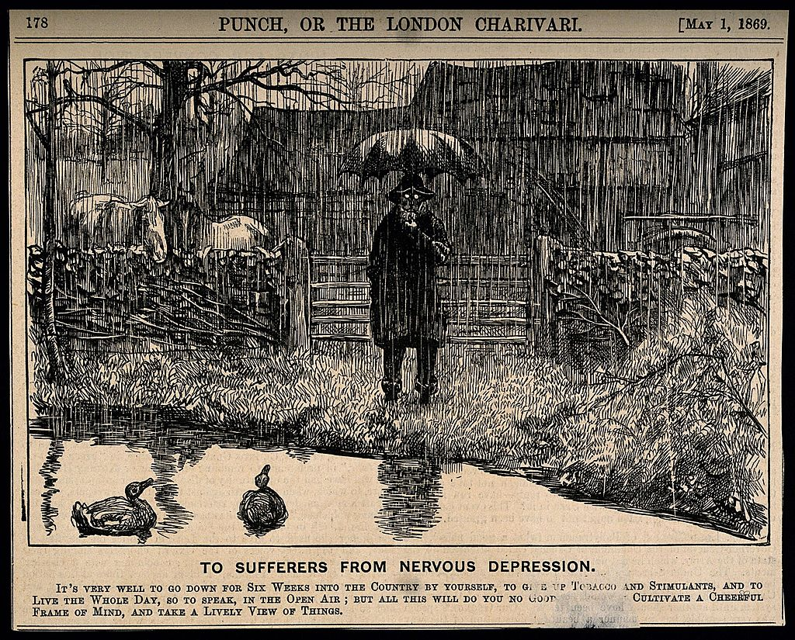
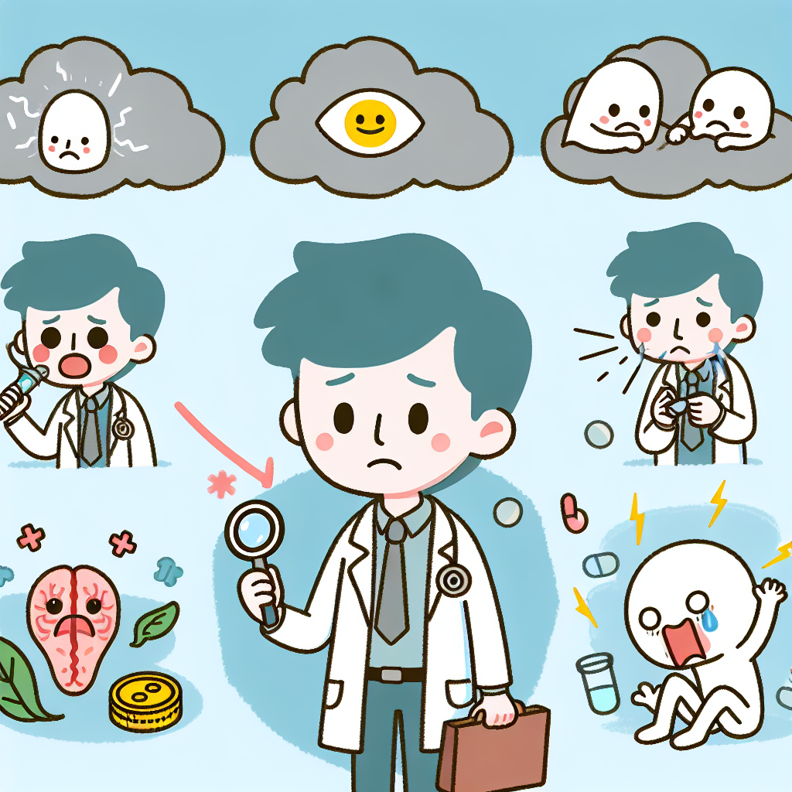
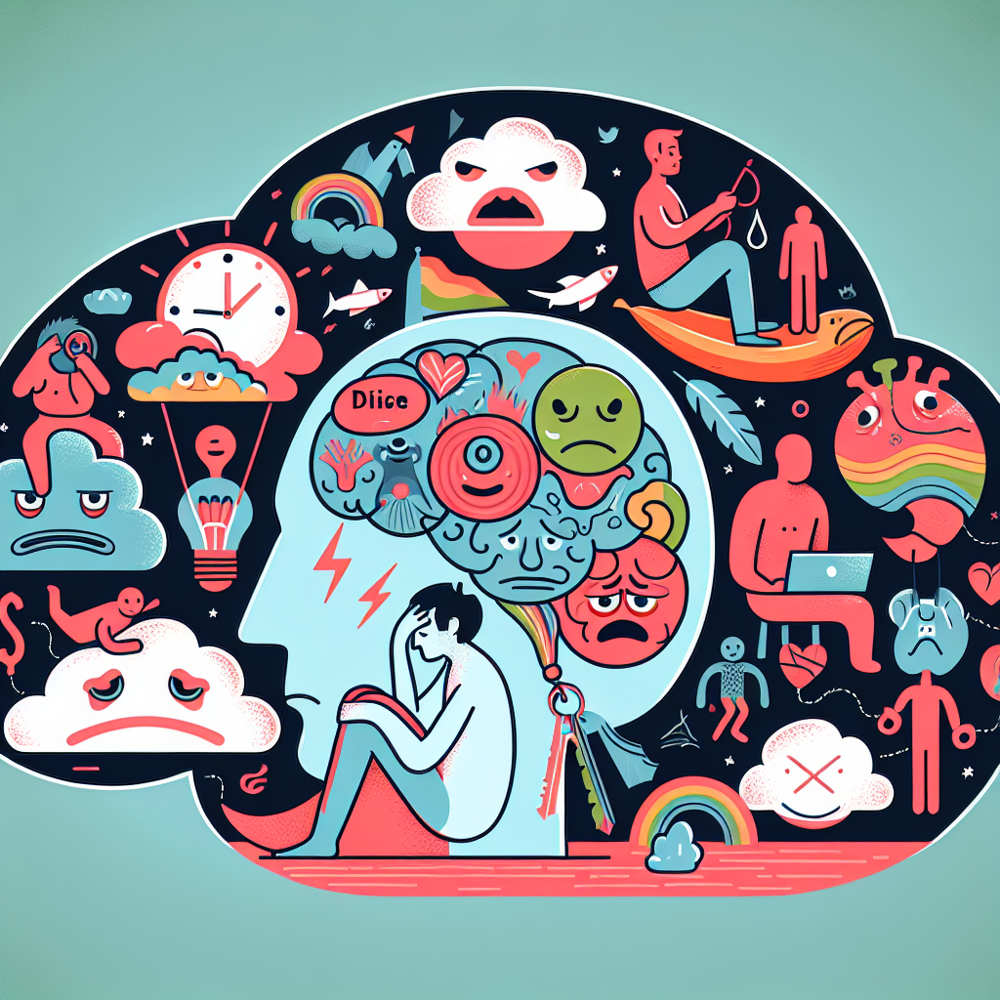

# 心境障碍

心境障碍（Mood Disorders）是一种以心境异常为主要表现的精神疾病，包括抑郁症、双相情感障碍、躁郁症等。心境障碍患者的心境会持续地处于低落或高涨状态，并伴有相应的认知、行为和生理症状。

## 心境障碍的影响

心境障碍会对患者的生活和工作产生重大影响。抑郁症患者可能会出现失眠、食欲下降、注意力不集中、工作效率下降等症状，严重时甚至会导致自杀。双相情感障碍患者可能会出现情绪波动剧烈、易激惹、冲动、攻击性等症状，影响患者的人际关系和社会功能。

## 心境障碍的临床特征

心境障碍的临床特征主要表现在以下几个方面：

* 心境异常：心境障碍患者的心境会持续地处于低落或高涨状态。抑郁症患者的心境通常是低落、悲伤、绝望，而双相情感障碍患者的心境则会在低落和高涨之间交替出现。
* 认知改变：心境障碍患者的认知功能会受到影响，表现为注意力不集中、记忆力下降、思维迟缓、决策能力下降等。
* 行为改变：心境障碍患者的行为会出现异常，表现为活动减少、社交退缩、自我照顾能力下降等。
* 生理症状：心境障碍患者可能会出现一些生理症状，如失眠、食欲下降、体重下降、疲劳、头痛、肌肉酸痛等。

## 心境障碍的诱因

心境障碍的诱因复杂，可能包括遗传、环境、心理等因素。遗传因素是心境障碍的重要致病因素，如果家族中有心境障碍患者，那么该患者患心境障碍的风险会增加。环境因素也可能导致心境障碍，如创伤性经历、生活压力、药物滥用等。心理因素也可能与心境障碍有关，如性格、认知方式等。

## 心境障碍对生活及工作的的影响

心境障碍会对患者的生活和工作产生重大影响。抑郁症患者可能会出现失眠、食欲下降、注意力不集中、工作效率下降等症状，严重时甚至会导致自杀。双相情感障碍患者可能会出现情绪波动剧烈、易激惹、冲动、攻击性等症状，影响患者的人际关系和社会功能。

## 心境障碍的治疗方法

心境障碍的治疗方法主要包括药物治疗和心理治疗。药物治疗可以帮助患者改善心境、认知和行为等方面的症状。心理治疗可以帮助患者了解和应对心境障碍，提高患者的心理健康水平。

## 心境障碍的预防

心境障碍的预防主要包括以下几个方面：

* 加强心理健康教育，提高公众对心境障碍的认识。
* 积极应对压力，保持健康的生活方式。
* 定期进行心理健康检查。

如果您或您的家人朋友出现了心境障碍的相关症状，请及时就医，接受专业的治疗。

--------
© 2023 時光手帳, Inc. TC999